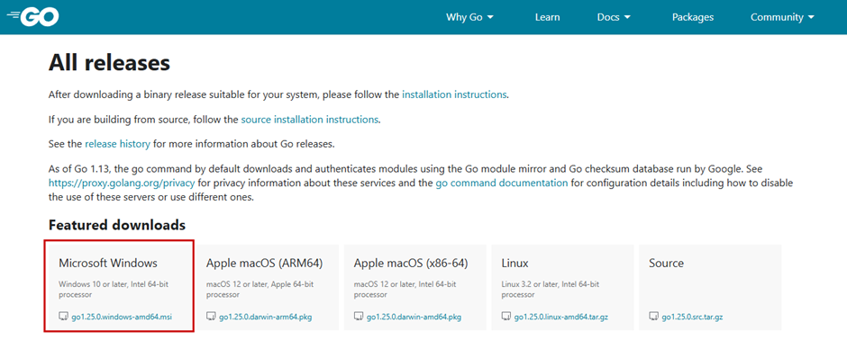

# Setup Go Project
## [https://go.dev/dl](https://go.dev/dl)


## Go Version
```dockerignore
go1.25.0 windows/amd64
```

## Create Go Project
```bash
go mod init backend-checklist
```

## Run Go
```bash
go run main.go
```