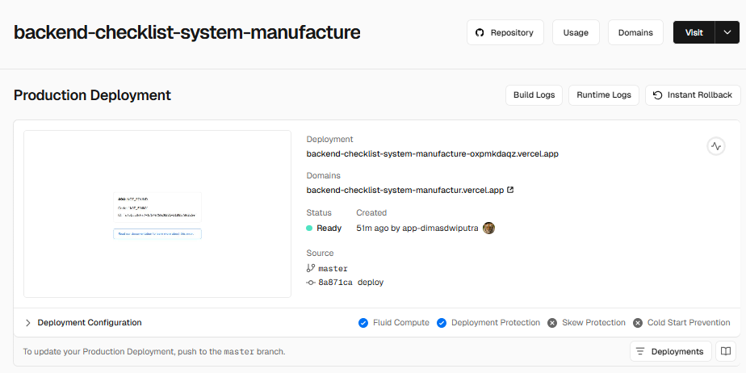

# Checklist System for Manufacture
### Backend  : [https://backend-checklist-system-manufactur.vercel.app/](https://backend-checklist-system-manufactur.vercel.app/)
### Frontend : [https://frontend-checklist-system-manufactu.vercel.app/](https://frontend-checklist-system-manufactu.vercel.app/)
This is a simple [Go](https://go.dev/dl/) project for a backend and a simple [Next.js](https://nextjs.org) project for a frontend with crud, authentication, temporary database, and using vercel for deployment
## Getting Started
### Install Project go to [Here](/Install.md)
First, run the development server:

```bash
go run main.go
```

Open [http://localhost:9090](http://localhost:9090) with your browser to see the result (local).

## Flow Proses
### Login
```dockerignore
User input username & password → Backend memvalidasi dan mengembalikan token JWT → Token disimpan di localStorage
```
### Checklist
Hanya bisa diakses jika token valid <br>
* Read Checklist
```
Fetch checklist dari backend menggunakan token
```
* Add checklist:
```dockerignore

Pilih kategori → Pilih task dari daftar saran → Submit → backend menyimpan data
```
* Update checklist:
```dockerignore
Klik tombol “Mark as Done / Mark as Pending” → Backend update status
```

* Delete checklist:
```dockerignore
Klik tombol Hapus → backend hapus data
```

### Logout
```dockerignore
Menghapus token dari localStorage → Redirect ke halaman login
```

## Front-end
### [https://github.com/Dimas263/frontend-checklist-system-manufacture](https://github.com/Dimas263/frontend-checklist-system-manufacture)
* Manage Checklist `CRUD` `Login Required`
* Login `Authentication`
* Structure
```dockerignore
/frontend-checklist
  /app
    page.js                      (halaman utama)
    api/login/route.js           (transaksi authentikasi dengan backend, fixed cors blocked on browser)
    login/page.js                (screen login dengan api)
    api/checklist/route.js       (transaksi crud checklist dengan backend, fixed cors blocked on browser)
    checklist/page.js            (screen manage checklist dengan crud api)
  package.json
```
## Back-end
### [https://github.com/Dimas263/backend-checklist-system-manufacture](https://github.com/Dimas263/backend-checklist-system-manufacture)
* Function Login Authentication `jwt token`
* Function Checklist `Create` `Read` `Update` `Delete`
* Temporary Database
* Structure
```dockerignore
/backend-checklist
  main.go
  go.mod
  api/auth.go         (authentikasi dan jwt token)
  api/checklist.go    (crud dengan temporary database/local storage)
  vercel.json         (deploy backend dengan vercel)
```
* API
```dockerignore
local  : http://localhost:9090
vercel : https://backend-checklist-system-manufactur.vercel.app/

Endpoints:

POST /login → login user

GET /checklist → ambil semua checklist

POST /checklist → tambah checklist

PUT /checklist → update status checklist

DELETE /checklist?id=... → hapus checklist
```

### Tools
* Frontend: `Next.js`, `React`, `TailwindCSS`
* Backend: `Golang`, `net/http`, `API`
* Deployment: `Vercel`
* Authentication: `JWT Token`
* Database : `Temporary Database`, `Local Storage`

### Deploy Backend with Vercel
* Deploy go backend success on vercel
* 
* Deploy go backend dashboard
* 
* 